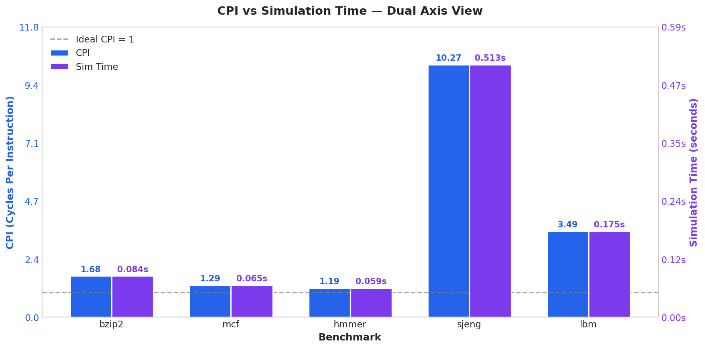
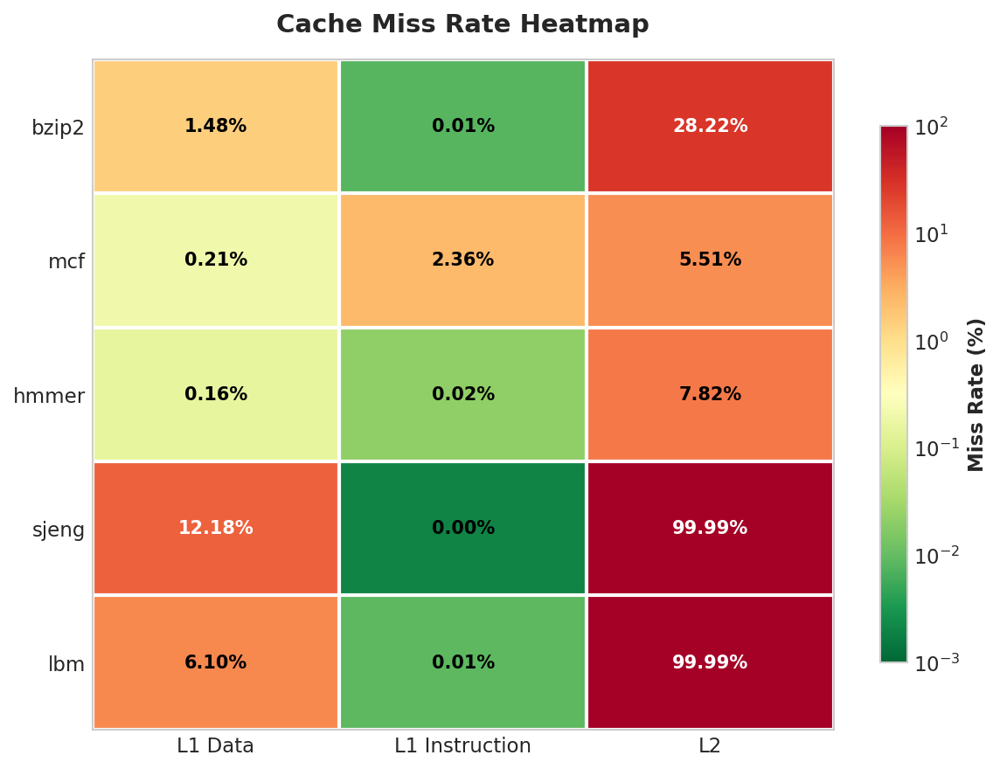
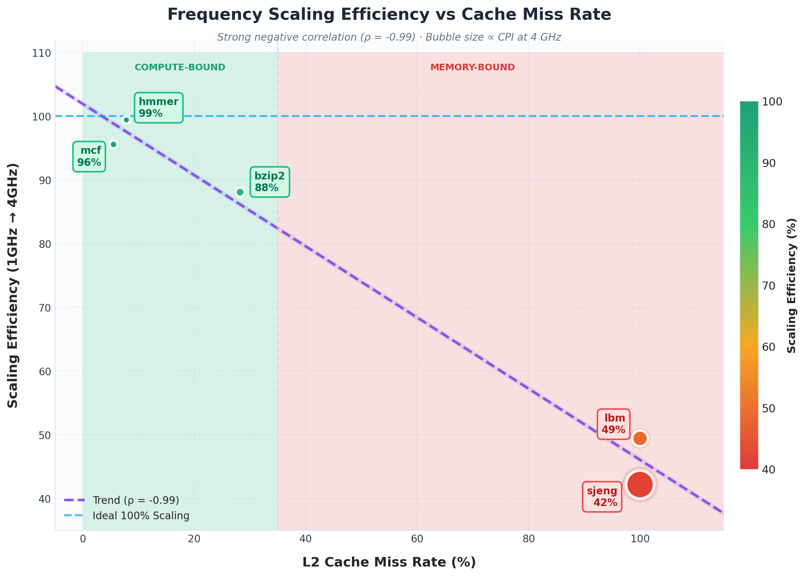
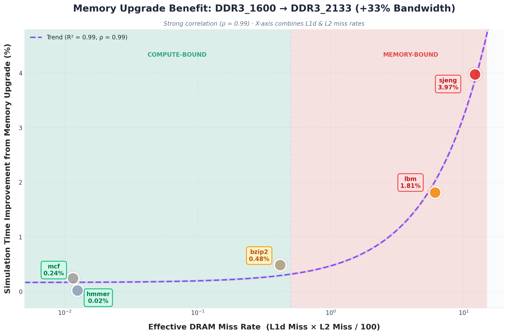
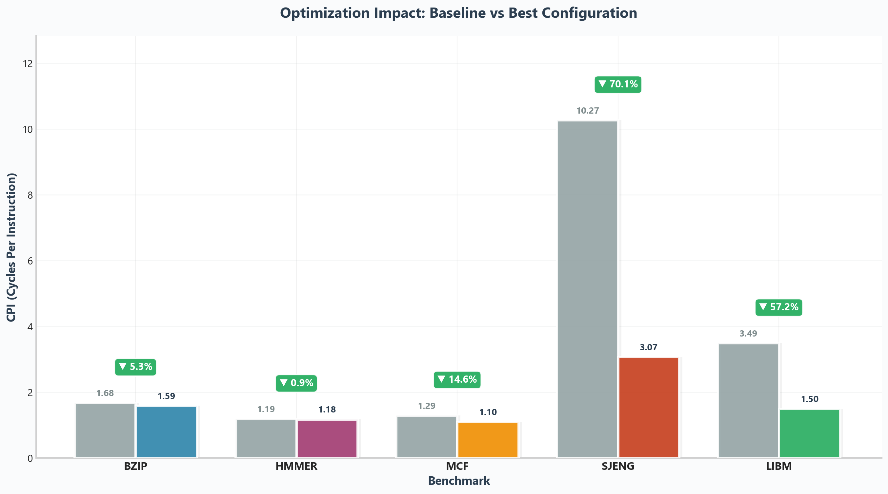
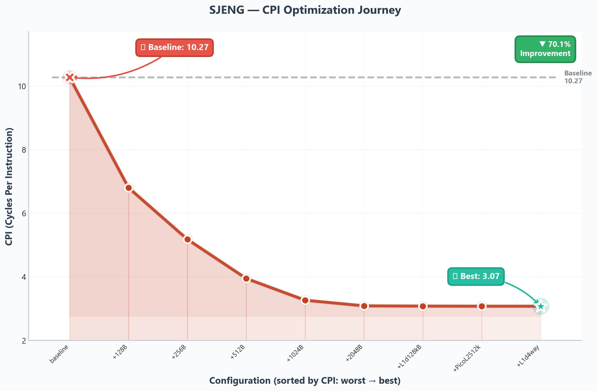
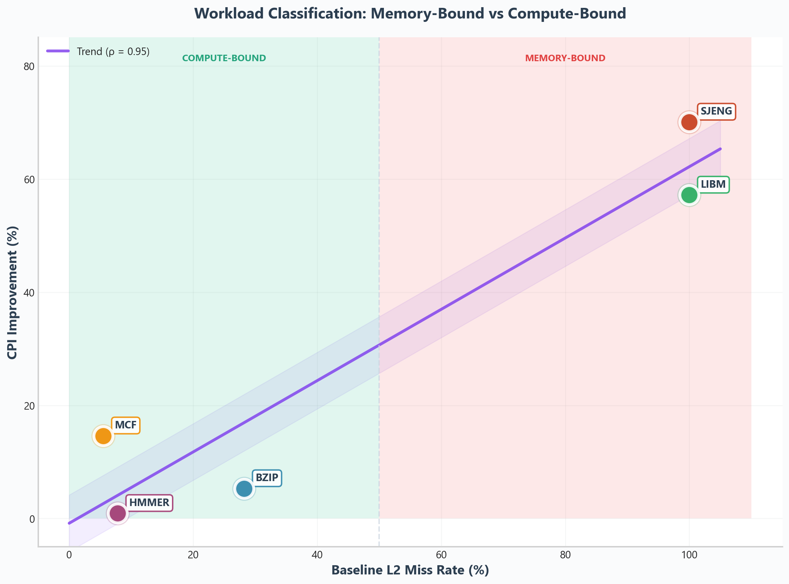
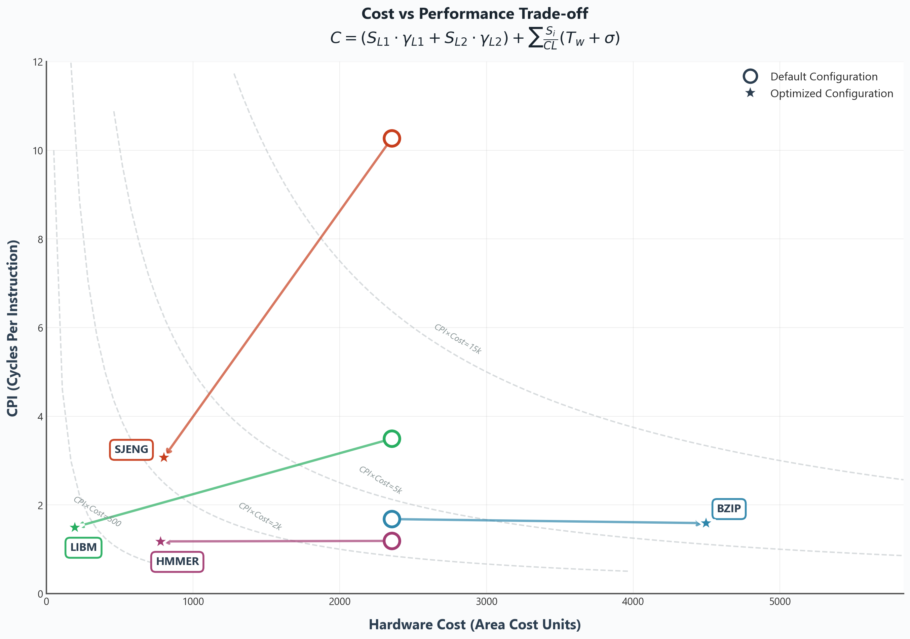
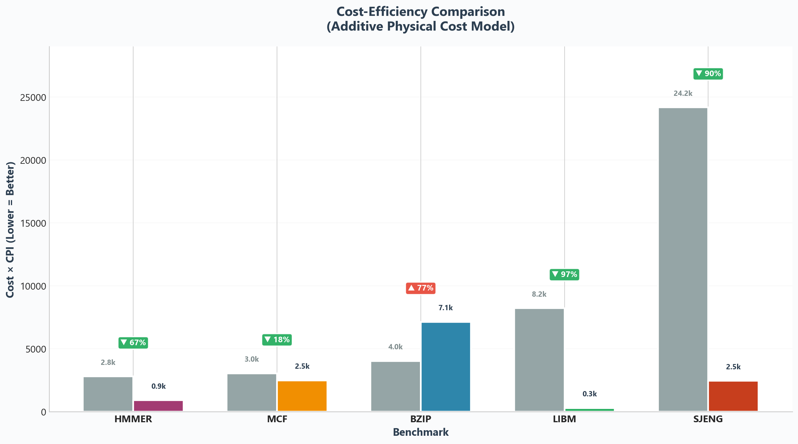

# 🖥️ gem5 Processor Simulation & Performance Analysis

<div align="center">


**A comprehensive analysis of processor performance using gem5 simulation and SPEC CPU2006 benchmarks**

> *Computer Architecture Lab - Bonus Assignment*
</div>

---

## 📑 Table of Contents

- [Part 1: Baseline Analysis \& Frequency Scaling](#part-1-baseline-analysis--frequency-scaling)
  - [Question 1: System Parameters](#question-1-system-parameters)
  - [Question 2: Baseline Performance Metrics](#question-2-baseline-performance-metrics)
  - [Question 3: Frequency Scaling](#question-3-frequency-scaling-1ghz-vs-4ghz)
  - [Question 4: Memory Technology Impact](#question-4-memory-technology-impact)
- [Part 2: Design Exploration](#part-2-design-exploration--performance-optimization)
  - [Benchmark Characterization](#benchmark-characterization-summary)
  - [Optimal Cache Configurations](#optimal-cache-configurations)
  - [Running Optimized Benchmarks](#running-optimized-benchmarks)
- [Part 3: Cost Function & Cost/Performance Optimization](#part-3-cost-function--costperformance-optimization)
  - [Cost Function Derivation](#cost-function-derivation)
  - [Cost Analysis Results](#cost-analysis-results)
  - [Optimal Architecture Recommendation](#optimal-architecture-recommendation)

---

## Part 1: Baseline Analysis & Frequency Scaling

### Question 1: System Parameters

The following system parameters were extracted from the gem5 configuration files ([`config.ini`](results/default/specbzip/config.ini)):

#### Cache Configuration

| Component | Size | Associativity | Block Size | Latency |
|-----------|------|---------------|------------|---------|
| [**L1 Instruction Cache**](results/default/specbzip/config.ini#L789) | 32 KB | 2-way | 64 bytes | 2 cycles |
| [**L1 Data Cache**](results/default/specbzip/config.ini#L155) | 64 KB | 2-way | 64 bytes | 2 cycles |
| [**L2 Cache**](results/default/specbzip/config.ini#L994) | 2 MB | 8-way | 64 bytes | 20 cycles |

#### [Memory Subsystem](results/default/specbzip/config.ini#L1062)

| Parameter | Value |
|-----------|-------|
| [**Main Memory Type**](results/default/specbzip/config.dot#L216) | DDR3_1600_x64 |
| **Memory Capacity** | 512 MB |
| **Memory Clock Period (tCK)** | 1250 ps (800 MHz) |
| **CAS Latency (tCL)** | 13.75 ns |
| **RAS to CAS Delay (tRCD)** | 13.75 ns |
| **Bank Count** | 8 banks per rank |
| **Ranks per Channel** | 2 |

#### Clock Domains

| Clock Domain | Period | Frequency |
|--------------|--------|-----------|
| [**System Clock**](results/default/specbzip/config.ini#L44) (`system.clk_domain`) | 1000 ps | 1 GHz |
| [**CPU Clock**](results/default/specbzip/config.ini#L973) (`system.cpu_clk_domain`) | 500 ps | 2 GHz |

#### CPU Configuration

| Parameter | Value |
|-----------|-------|
| [**CPU Type**](results/default/specbzip/config.ini#L52) | MinorCPU (in-order pipeline) |
| **Max Instructions** | 100,000,000 |
| **Execute Commit Limit** | 2 instructions/cycle |
| **Execute Issue Limit** | 2 instructions/cycle |
| **Decode Input Width** | 2 |
| [**Branch Predictor**](results/default/specbzip/config.ini#L124) | TournamentBP (8192 entries) |

---

### Question 2: Baseline Performance Metrics

The following metrics were extracted from `stats.txt` for each SPEC CPU2006 benchmark (simulated for 100 million instructions).

| Benchmark | Sim Time (s) | Instructions | CPI | L1d Miss Rate | L1i Miss Rate | L2 Miss Rate |
| :--- | :--- | :--- | :--- | :--- | :--- | :--- |
| **401.bzip2** | 0.0840 | 100M | 1.68 | 1.48% | 0.008% | 28.22% |
| **429.mcf** | 0.0647 | 100M | 1.29 | 0.21% | 2.36% | 5.51% |
| **456.hmmer** | 0.0594 | 100M | 1.19 | 0.16% | 0.022% | 7.82% |
| **458.sjeng** | 0.5135 | 100M | **10.27** | **12.18%** | 0.002% | **99.99%** |
| **470.lbm** | 0.1747 | 100M | 3.49 | 6.10% | 0.009% | **99.99%** |

#### Performance Visualization


*Figure 1: Comparison of CPI (left axis) and Simulation Time (right axis) across benchmarks.*


<sub>*Figure 2: Cache Miss Rates across L1 Data, L1 Instruction, and L2 caches. Green indicates low miss rates (good), red indicates high miss rates (memory-bound).*</sub>

---

#### Key Observations

The simulation results highlight a **massive disparity in performance**, driven almost entirely by the **Memory Wall**, the speed gap between the CPU and off-chip RAM.

**From the Visualizations:**
- The **CPI vs Simulation Time** plot shows direct correlation (fixed 100M instructions), with the **Ideal CPI = 1** line revealing performance gaps
- The **Cache Miss Heatmap** reveals two distinct patterns: green (excellent locality) vs red (memory-bound)
- **L2 miss rate** is the strongest predictor of poor CPI performance

#### Behavioral Classification

| Cluster | Benchmarks | Pattern | Key Insight |
|---------|------------|---------|-------------|
| **Locality** | hmmer, mcf | Near-ideal CPI (≈1.2) | Working set fits in L1/L2 - CPU rarely waits for memory |
| **Mixed** | bzip2 | Moderate CPI (≈1.7) | Compression dictionary slightly exceeds L2 capacity |
| **Streaming** | lbm | Poor CPI (≈3.5) | Sequential access - L1 filters 94% but L2 is 100% miss |
| **Thrashing** | sjeng | Severe CPI (>10) | Random access + 100% L2 miss - CPU stalls on memory |

#### Detailed Benchmark Analysis

##### 1. The "Locality" Cluster (hmmer, mcf)

**hmmer** (Best performer, CPI = 1.188)
- Hidden Markov Model computations with excellent data locality
- All cache miss rates below 8% — working set fits entirely in cache hierarchy
- **Bottleneck:** None. Pipeline remains full.

**mcf** (CPI = 1.294)
- Graph-based combinatorial optimization
- Highest L1i miss rate (2.36%) indicates complex branching control flow
- **Bottleneck:** Branch prediction. Complex control flow confuses the fetch unit.
- *Note:* While mcf is typically memory-bound in full runs, this 100M instruction slice represents a compute-heavy phase.

##### 2. The "Mixed" Workload (bzip2)

**bzip2** (CPI = 1.680)
- Data compression with streaming access patterns
- 28% L2 miss rate shows compression dictionary slightly exceeds L2 capacity
- **Bottleneck:** L2 Capacity. Frequent but not constant memory trips.

##### 3. The "Streaming" Workload (lbm)

**lbm** (CPI = 3.494)
- Lattice Boltzmann fluid dynamics simulation with large array operations (massive 3D grid, hundreds of megabytes)
- **L1 Miss (6.1%):** Manageable: hardware prefetcher helps with sequential data
- **L2 Miss (99.99%):** Catastrophic: dataset far exceeds L2 capacity
- **Bottleneck:** Memory Bandwidth. L2 becomes a "pass-through" buffer, performance limited by RAM throughput.

##### 4. The "Thrashing" Anomaly (sjeng)

**sjeng** (Worst performer, CPI = 10.271)
- Chess engine with complex data structures (game trees, hash tables)
- **L1 Miss (12.18%):** Highest in suite: random tree traversals defeat spatial locality
- **L2 Miss (99.99%):** Catastrophic: random access patterns prevent any successful caching
- **The Compound Effect:** High L1 misses + 100% L2 misses = frequent stalls. The CPU constantly waits for data, exposing the full DRAM access latency.
- **Bottleneck:** Memory Latency. CPU stalls on almost every memory instruction.

#### Architectural Bottleneck Summary

| Benchmark | Classification | Primary Bottleneck |
|-----------|----------------|-------------------|
| **hmmer** | Compute-Bound | None - excellent locality keeps pipeline full |
| **mcf** | Compute/Branch-Bound | Branch prediction (2.36% L1i miss rate) |
| **bzip2** | Mixed | L2 capacity (28% miss rate) |
| **lbm** | Bandwidth-Bound | L2 capacity & memory bandwidth (99.99% L2 miss) |
| **sjeng** | Latency-Bound | Memory latency - stalling on nearly every access |

---

### Question 3: Frequency Scaling (1GHz vs 4GHz)

#### Clock Configuration Analysis

Three configurations were tested using `--cpu-clock` parameter:

| Configuration | `system.clk_domain.clock` | `cpu_clk_domain.clock` | CPU Frequency |
| :--- | :---: | :---: | :---: |
| [**1 GHz Test**](results/1GHz/specbzip/config.ini) | 1000 ps (1 GHz) | 1000 ps | **1 GHz** |
| [**Default**](results/default/specbzip/config.ini) | 1000 ps (1 GHz) | 500 ps | **2 GHz** |
| [**4 GHz Test**](results/4GHz/specbzip/config.ini) | 1000 ps (1 GHz) | 250 ps | **4 GHz** |

> **Key Finding:** The `system.clk_domain` remains constant at 1 GHz across all tests, while only `cpu_clk_domain` changes with the `--cpu-clock` parameter.

---

#### What Gets Clocked at Each Frequency?

| Clock Domain | Components | Affected by `--cpu-clock`? |
| :--- | :--- | :---: |
| **CPU Clock** | CPU pipeline, L1 caches, L2 cache, TLBs, L1-to-L2 bus | ✅ Yes |
| **System Clock** | Memory controller, memory bus, DRAM timings | ❌ No (fixed at 1 GHz) |

**Why This Separation?**
1. **Memory Technology Limits** — DRAM speeds are constrained by physical properties (capacitor charge/discharge times)
2. **Realistic Modeling** — In real systems, memory cannot scale with CPU frequency
3. **Power Constraints** — Memory runs at lower frequencies to manage power dissipation

> **💡 If we added another processor:**
> - If it uses `cpu_clk_domain` → Same frequency as `--cpu-clock` parameter
> - If it has its own clock domain → Requires explicit configuration

---

#### Frequency Scaling Results

**Simulation Time (seconds):**

| Benchmark | 1 GHz | 2 GHz (Default) | 4 GHz | Speedup (1→4 GHz) | Ideal |
| :--- | :---: | :---: | :---: | :---: | :---: |
| **401.bzip2** | 0.1610 | 0.0840 | 0.0457 | **3.52×** | 4× |
| **429.mcf** | 0.1273 | 0.0647 | 0.0333 | **3.82×** | 4× |
| **456.hmmer** | 0.1185 | 0.0594 | 0.0298 | **3.98×** | 4× |
| **458.sjeng** | 0.7041 | 0.5135 | 0.4175 | **1.69×** | 4× |
| **470.lbm** | 0.2623 | 0.1747 | 0.1327 | **1.98×** | 4× |

**CPI (Cycles Per Instruction):**

| Benchmark | 1 GHz | 2 GHz (Default) | 4 GHz | CPI Increase |
| :--- | :---: | :---: | :---: | :---: |
| **401.bzip2** | 1.61 | 1.68 | 1.83 | +13.5% |
| **429.mcf** | 1.27 | 1.29 | 1.33 | +4.8% |
| **456.hmmer** | 1.19 | 1.19 | 1.19 | +0.7% |
| **458.sjeng** | 7.04 | 10.27 | **16.70** | **+137%** |
| **470.lbm** | 2.62 | 3.49 | **5.31** | **+102%** |

> **Note:** Cache miss rates (L1d, L1i, L2) remain **unchanged** across all frequencies. They depend on memory access patterns, not clock speed.

#### Scaling Efficiency Visualization


*Figure 3: Strong negative correlation (ρ = -0.99) between L2 miss rate and frequency scaling efficiency. Higher cache misses = worse scaling.*

> **Key Insight:** L2 miss rate is the **single best predictor** of frequency scaling efficiency. Benchmarks with <30% L2 miss rate achieve >85% scaling efficiency.

---

#### Is There Perfect Scaling?

**No.** The analysis reveals a clear dichotomy between workload types:

| Category | Benchmarks | Actual Speedup | Scaling Efficiency | L2 Miss Rate |
| :--- | :--- | :---: | :---: | :---: |
| 🟢 **Compute-Bound** | hmmer, mcf, bzip2 | 3.5×–4.0× | 88%–100% | 5%–28% |
| 🔴 **Memory-Bound** | sjeng, lbm | 1.7×–2.0× | 42%–50% | ~100% |

**Why No Perfect Scaling?**

1. **Memory Latency is Fixed** — DRAM access time (e.g., ~50 ns) doesn't scale with CPU frequency
   - At 1 GHz: 50 ns = 50 CPU cycles of waiting
   - At 4 GHz: 50 ns = **200 CPU cycles** of waiting (4× more stalls)

2. **Amdahl's Law** — Memory-bound portions cannot benefit from faster CPU
   - If 50% of execution is memory-bound, maximum speedup is 2× regardless of CPU frequency

---

### Question 4: Memory Technology Impact

#### Experiment Setup

Benchmarks were re-run with upgraded memory to evaluate the impact of faster DRAM:

| Memory Technology | [DDR3_1600_x64 (Baseline)](results/default/specbzip/config.ini) | [DDR3_2133_x64 (Upgraded)](results/DDR3_2133_8x8/specbzip/config.ini) |
|-------------------|--------------------------|--------------------------|
| **Memory Clock** | 800 MHz | 1066 MHz |
| **Peak Bandwidth** | 12.8 GB/s | 17.0 GB/s |
| **Improvement** | — | **+33% bandwidth** |

> **Note:** The memory controller remains clocked at the system frequency (1 GHz), while the DRAM operates at its native speed. The bandwidth improvement comes from faster memory transactions.

---

#### DDR3_2133 Benchmark Results


*Figure 4: Memory upgrade benefit correlates strongly with effective DRAM miss rate (L1d × L2 / 100, log-scale x-axis).*

> **Expected Behavior Confirmed:** Cache miss rates remain **identical** between memory technologies — miss rates depend on access patterns and cache hierarchy design, not memory speed.

---

#### Performance Improvement Analysis

##### Improvement vs. Effective DRAM Miss Rate Correlation

L2 miss rate alone poorly predicts memory upgrade benefit — sjeng and lbm both have 99.99% L2 miss rate but very different improvements. Instead, we use **Effective DRAM Miss Rate = L1d Miss × L2 Miss / 100**, which captures the actual fraction of instructions reaching main memory.

| Benchmark | L1d Miss | L2 Miss | Effective DRAM Miss | Improvement | Classification |
|-----------|----------|---------|--------------------:|----------------:|----------------|
| **hmmer** | 0.16% | 7.82% | 0.013 | 0.02% | 🟢 Compute-bound |
| **mcf** | 0.21% | 5.51% | 0.012 | 0.24% | 🟢 Compute-bound |
| **bzip2** | 1.48% | 28.22% | 0.418 | 0.48% | 🟡 Mixed |
| **lbm** | 6.10% | 99.99% | 6.099 | 1.81% | 🔴 Memory-bound |
| **sjeng** | 12.18% | 99.99% | 12.179 | 3.97% | 🔴 Severely Memory-bound |

This combined metric yields a near-perfect correlation (**ρ = 0.99, R² = 0.99**), confirming that the **volume of memory traffic reaching DRAM** determines memory upgrade benefit.

---

## Part 2: Design Exploration – Performance Optimization

Based on Part 1 analysis, we designed **targeted cache configurations** for each benchmark to optimize performance while respecting the constraints:
- **Total L1 Size ≤ 256KB** (L1i + L1d)
- **Total L2 Size ≤ 4MB**

### Optimization Results Summary

| Benchmark | Default CPI | Optimized CPI | Improvement | Key Optimization |
|-----------|-------------|---------------|-------------|------------------|
| **spechmmer** | 1.188 | **1.177** | +0.93% | 256B cacheline, 64kB L1i, 128kB L1d |
| **specmcf** | 1.294 | **1.105** | +14.61% | 512B cacheline |
| **specbzip** | 1.680 | **1.589** | +5.42% | 256B cacheline, 128kB L1d, 4MB L2, 16-way assoc |
| **speclibm** | 3.494 | **1.496** | +57.18% | 2048B cacheline (extreme) |
| **specsjeng** | 10.271 | **3.072** | +70.09% | 2048B cacheline, 128kB L1d, 4-way assoc |


*Figure 5: Baseline vs Optimized CPI comparison across all benchmarks.*

---

### Tested Configurations with Results

#### 1. spechmmer (Compute-Bound)

**Workload Characteristics:**
- Hidden Markov Model computations with **excellent data locality**
- Working set fits entirely within L2 cache (7.82% L2 miss rate)
- Very low L1d miss rate (0.16%) indicates temporal data reuse
- Minimal instruction footprint (0.022% L1i miss rate)

**Optimization Hypothesis:** This benchmark is already near-optimal. Large cache investments should show **diminishing returns** since the workload is compute-bound, not memory-bound.

| Config | L1i | L1d | L2 | Assoc (i/d/L2) | Cacheline | CPI | Rationale |
|--------|-----|-----|-----|----------------|-----------|-----|-----------|
| baseline | 32kB | 64kB | 2MB | 2/2/8 | 64B | 1.188 | **Default Config** — establishes baseline performance |
| minimal | 32kB | 32kB | 512kB | 2/2/4 | 64B | 1.191 | **Minimal viable config** — establishes lower bound for cache sizes |
| +L1d | 32kB | **64kB** | 512kB | 2/2/4 | 64B | 1.188 | **Double L1d** — tests if L1d capacity is limiting factor |
| +L1d=128 | 32kB | **128kB** | 512kB | 2/8/4 | 64B | 1.185 | **Max L1d + higher assoc** — pushes L1d to limit, 8-way reduces conflicts |
| +128B | 32kB | 128kB | 512kB | 2/8/4 | **128B** | 1.180 | **Double cacheline** — tests spatial locality exploitation |
| +256B | 32kB | 128kB | 512kB | 2/8/4 | **256B** | 1.178 | **4× cacheline** — aggressive prefetch for sequential patterns |
| +L1i | **64kB** | 128kB | 512kB | 2/8/4 | 256B | **1.177** | **Double L1i** — tests if instruction cache was limiting |

> **Note:** Tested larger L2 (1MB, 2MB), higher L1 associativity, and 512B cacheline — **no measurable improvement**, confirming compute-bound nature.

**Analysis:**
- **All configurations within 1.2% of each other** — confirms compute-bound classification
- L2 size increase (512kB→2MB) showed **no improvement** — working set already fits in 512kB L2
- L1d increase (32kB→128kB) provided **tiny 0.5% improvement** — marginal L1d miss reduction
- **256B cacheline + 64kB L1i** provided best result by:
  - Reducing instruction fetch overhead (larger instruction blocks)
  - Prefetching adjacent data in tight HMM computation loops

**Conclusion:** Near-optimal with default config. Investment in cache resources provides negligible returns.

---

#### 2. specmcf (Instruction-Bound with Pointer-Chasing)

**Workload Characteristics:**
- Graph-based combinatorial optimization (vehicle scheduling)
- **Highest L1i miss rate** in suite (2.36%) — complex control flow with many branches
- Pointer-chasing access patterns through linked data structures
- L2 miss rate moderate (5.51%) — working set mostly fits, but irregular accesses cause conflicts

**Optimization Hypothesis:** High L1i miss rate suggests **L1i capacity misses** — increasing L1i should improve performance. Larger cachelines may also improve pointer-chasing performance by prefetching adjacent graph nodes (due to allocator locality).

| Config | L1i | L1d | L2 | Assoc (i/d/L2) | Cacheline | CPI | Rationale |
|--------|-----|-----|-----|----------------|-----------|-----|-----------|
| baseline | 32kB | 64kB | 2MB | 2/2/8 | 64B | 1.29 | **Default Config** — establishes baseline performance |
| large_l1i | 64kB | 32kB | 512kB | 2/2/4 | 64B | 1.162 | **Larger L1i baseline** — addresses high L1i miss rate |
| +assoc | 64kB | **64kB** | 512kB | 2/4/4 | 64B | 1.160 | **Double L1d + 4-way** — tests L1d impact in isolation |
| balanced | 64kB | 64kB | **2MB** | 4/4/8 | 64B | 1.152 | **Balanced config** — moderate investments across hierarchy |
| +128B | 64kB | 64kB | 2MB | 4/4/8 | **128B** | 1.122 | **2× cacheline** — 2.6% improvement from spatial locality |
| +L2 | 64kB | 64kB | **4MB** | 4/4/16 | 128B | 1.122 | **128B + max L2** — confirms cacheline is dominant |
| +256B,L1i=2way | 64kB | 64kB | 2MB | 2/4/8 | **256B** | 1.106 | **4× cacheline** — tests aggressive prefetch |
| +512B | 64kB | 64kB | 2MB | 4/4/8 | **512B** | **1.105** | **8× cacheline** — pointer chains benefit from aggressive prefetch |

---

**Analysis:**
- **Doubling L1i to 64kB provided significant speedup** (CPI 1.29 → 1.16) — confirms primary bottleneck was **L1i capacity**
- **128B cacheline provided further gains** — 2.6% improvement from 64B baseline
- **512B cacheline achieved best CPI (1.105)** — 14.6% total improvement
- Why larger cachelines help pointer-chasing:
  - Graph nodes often clustered in memory (allocator locality)
  - Prefetching adjacent nodes reduces miss penalty for linked traversals
  - Larger blocks amortize memory access latency

**Conclusion:** Workload benefits from a **two-pronged approach**: increasing L1i size to resolve instruction capacity misses, and increasing cacheline size to accelerate data pointer chasing.

---

#### 3. specbzip (Data-Centric Streaming)

**Workload Characteristics:**
- Block-sorting compression algorithm (Burrows-Wheeler Transform)
- **28% L2 miss rate** — compression dictionary slightly exceeds L2 capacity
- 1.48% L1d miss rate — moderate but not severe
- Sequential streaming access pattern during sorting phases

**Optimization Hypothesis:** **L2 capacity is the primary bottleneck** (28% miss rate), but the **moderate L1d miss rate (1.48%)** suggests opportunities for improvement. Larger L1d to capture BWT blocks, combined with larger L2 and cachelines, should reduce miss penalties.

| Config | L1i | L1d | L2 | Assoc (i/d/L2) | Cacheline | CPI | Rationale |
|--------|-----|-----|-----|----------------|-----------|-----|-----------|
| baseline | 32kB | 64kB | 2MB | 2/2/8 | 64B | 1.68 | **Default Config** — establishes baseline performance |
| +L1d | 32kB | **128kB** | 2MB | 2/4/8 | 64B | 1.643 | **Max L1d + 4-way** — reduces L1d miss penalty (+2.2%) |
| +128B | 32kB | 128kB | 2MB | 2/4/8 | **128B** | 1.626 | **2× cacheline** — tests spatial locality benefit (+1.0%) |
| +256B | 32kB | 128kB | 2MB | 2/4/8 | **256B** | 1.615 | **4× cacheline** — aggressive block sorting prefetch (+0.7%) |
| +256B,L2=4M | 32kB | 128kB | **4MB** | 2/4/16 | 256B | 1.600 | **Max L2 + 256B** — compound optimization (+0.9%) |
| +assoc | 32kB | 128kB | 4MB | 2/**8**/16 | 256B | 1.591 | **8-way L1d** — reduces conflict misses in sorted blocks |
| +L1d,16way | 32kB | 128kB | 4MB | 2/**16**/16 | 256B | **1.589** | **16-way L1d** — eliminates nearly all L1d conflicts |

> **Note:** Tested larger L1i (64kB, 128kB) and larger cachelines (512B) — **no additional improvement**.

**Analysis:**
- **Progressive improvement** from each optimization (additive benefits)
- **256B cacheline critical** — reduced L2 miss rate from 32% to 16% (halved!)
- **128kB L1d** reduced L1d miss rate from 1.48% to 0.93% — captures more BWT blocks
- **4MB L2** helped capture more of the compression dictionary
- **16-way L1d associativity** eliminated conflict misses during sorting passes

**Conclusion:** Data streaming workload benefits from **layered optimizations** — each level of cache hierarchy contributes.

---

#### 4. speclibm (Severely Memory-Bound Streaming)

**Workload Characteristics:**
- Lattice Boltzmann Method (LBM) fluid dynamics simulation
- **99.99% L2 miss rate** — dataset far exceeds any practical cache size
- Sequential streaming access through 3D fluid grids
- 6.1% L1d miss rate — perfectly predictable stream pattern

**Optimization Hypothesis:** Cache size is **irrelevant** — the dataset won't fit. Focus on **reducing miss count** via large cachelines (implicit prefetching).

| Config | L1i | L1d | L2 | Assoc (i/d/L2) | Cacheline | CPI | Rationale |
|--------|-----|-----|-----|----------------|-----------|-----|-----------|
| baseline | 32kB | 64kB | 2MB | 2/2/8 | 64B | 3.494 | **Default Config** — establishes memory-bound baseline |
| +128B | 32kB | 64kB | 2MB | 2/2/8 | **128B** | 2.581 | **2× cacheline** — **-26% CPI!** streaming pattern benefits |
| +256B | 32kB | 64kB | 2MB | 2/2/8 | **256B** | 1.991 | **4× cacheline** — **-23% additional!** diminishing but significant |
| +512B | 32kB | 64kB | 2MB | 2/2/8 | **512B** | 1.704 | **8× cacheline** — still gaining! -14% additional |
| +1024B | 32kB | 64kB | 2MB | 2/2/8 | **1024B** | 1.536 | **16× cacheline** — -10% additional |
| +2048B | 32kB | 64kB | 2MB | 2/2/8 | **2048B** | **1.496** | **32× cacheline** — approaching minimum |
| +Micro L2-Direct | 32kB | 32kB | 256kB | 1/2/1 | 2048B | 1.496 | **Minimal L2 + direct-mapped** — proves L2 size irrelevant |
| +Nano L2 128k | 16kB | 32kB | 128kB | 1/2/1 | 2048B | 1.497 | **Extreme reduction** — proves only cacheline matters |
| +Pico L1d 16k | 16kB | 16kB | 128kB | 1/2/1 | 2048B | 1.498 | **Minimal everything** — same result! |

**Key Observation:** With 2048B cacheline, **CPI is identical across all cache configurations** (1.496-1.498) — L1d miss rate drops to 0.19%, meaning almost every access hits in the prefetched cacheline.

**Analysis:**
- **Cacheline size is the ONLY factor that matters**
- **2048B cacheline** reduced CPI from 3.494 → 1.496 (**57% improvement!**)
- L1d miss rate dropped from 6.1% (64B) → 0.19% (2048B) — **32× reduction**
- Cache size variations (32kB→128kB L1d, 128kB→2MB L2) showed **zero impact** with 2048B cacheline

**Why this works:** LBM has **perfect streaming locality** — each grid cell is accessed exactly once per timestep in sequential order. Large cachelines act as **software prefetching** by loading entire cache-aligned rows.

**Conclusion:** For streaming workloads, **maximize cacheline size** up to system stability limits. All other cache parameters are secondary.

---

#### 5. specsjeng (Severely Memory-Bound with Random Access)

**Workload Characteristics:**
- Chess engine with game tree search (minimax + alpha-beta pruning)
- **99.99% L2 miss rate** — hash tables and game trees exceed cache capacity
- **12.18% L1d miss rate** — highest in suite, random tree traversal defeats spatial locality
- Complex pointer-following and hash table lookups

**Optimization Hypothesis:** Similar to speclibm, cache size won't help. However, unlike LBM's perfect streaming, sjeng has **irregular access patterns** — cacheline optimization may have diminishing returns.

| Config | L1i | L1d | L2 | Assoc (i/d/L2) | Cacheline | CPI | Rationale |
|--------|-----|-----|-----|----------------|-----------|-----|-----------|
| baseline | 32kB | 64kB | 2MB | 2/2/8 | 64B | 10.271 | **Default Config** — extreme memory-bound baseline |
| +128B | 32kB | 64kB | 2MB | 2/2/8 | **128B** | 6.799 | **2× cacheline** — **-34% CPI!** significant despite irregular access |
| +256B | 32kB | 64kB | 2MB | 2/2/8 | **256B** | 5.176 | **4× cacheline** — **-24% additional** |
| +512B | 32kB | 64kB | 2MB | 2/2/8 | **512B** | 3.944 | **8× cacheline** — still significant -24% |
| +1024B | 32kB | 64kB | 2MB | 2/2/8 | **1024B** | 3.261 | **16× cacheline** — -17% |
| +2048B | 32kB | 64kB | 2MB | 2/2/8 | **2048B** | 3.084 | **32× cacheline** — approaching floor |
| +L1d 128kB | 32kB | **128kB** | 2MB | 2/2/8 | 2048B | 3.076 | **Double L1d** — tiny additional gain (-0.3%) |
| +L1d 4way | 32kB | 128kB | 2MB | 2/**4**/8 | 2048B | **3.072** | **4-way L1d** — eliminates remaining conflicts |
| +Pico L2 512k | 16kB | 128kB | **512kB** | 2/4/2 | 2048B | 3.072 | **Minimal L2** — proves L2 size irrelevant |

**Analysis:**
- **2048B cacheline achieved 70% CPI reduction** (10.271 → 3.084)
- Unlike speclibm, additional L1d tuning provided **small but measurable benefit** (3.084 → 3.072)
- L1d miss rate reduced from 12.18% (64B) → 0.38% (2048B) — **32× reduction**


*Figure 6: SJENG optimization journey showing 70% CPI reduction through cacheline scaling.*

---

### Key Findings


*Figure 7: Workload classification showing strong correlation between L2 miss rate and optimization potential.*

#### Optimal Configurations

| Benchmark | L1i | L1d | L2 | Assoc (i/d/L2) | Cacheline | Final CPI | Improvement |
|-----------|-----|-----|-----|----------------|-----------|-----------|-------------|
| **spechmmer** | 64kB | 128kB | 512kB | 2/8/4 | 256B | **1.177** | +1.2% |
| **specmcf** | 64kB | 64kB | 2MB | 4/4/8 | 512B | **1.105** | +14.6% |
| **specbzip** | 32kB | 128kB | 4MB | 2/16/16 | 256B | **1.589** | +5.4% |
| **speclibm** | 32kB | 32kB | 256kB | 1/2/1 | 2048B | **1.496** | +57.2% |
| **specsjeng** | 16kB | 128kB | 512kB | 2/4/2 | 2048B | **3.072** | +70.1% |

---

## Part 3: Cost Function & Cost/Performance Optimization

### Cost Function Derivation

To model silicon cost accurately, we developed a **physically-based additive cost function** that reflects actual cache architecture. This section provides the complete derivation and validation of our cost model.

---

#### Cache Architecture Components

A cache chip consists of three main components, each with distinct cost characteristics:

```
┌─────────────────────────────────────────────────────┐
│                    CACHE CHIP                       │
├─────────────────────────────────────────────────────┤
│  ┌───────────────────────────────────────────────┐  │
│  │             DATA ARRAY (95%)                  │  │ ← Fixed by capacity
│  │         Stores actual cache data              │  │    NOT affected by
│  │         Size = Capacity in bits               │  │    associativity
│  └───────────────────────────────────────────────┘  │
│  ┌─────────────────────┐ ┌─────────────────────┐    │
│  │   TAG ARRAY (4%)    │ │  LOGIC (1%)         │    │ ← Scales with:
│  │   Stores addresses  │ │  Comparators, MUX   │    │    - Associativity
│  │   Size ∝ 1/LineSize │ │  Decoders, LRU      │    │    - 1/LineSize
│  └─────────────────────┘ └─────────────────────┘    │
└─────────────────────────────────────────────────────┘
```

Our **additive cost model** reflects this structure:
$$C = C_{data} + C_{tag} + C_{logic}$$

Each component scales independently based on its own physics.

---

#### Cost Model Derivation

##### Step 1: Data Array Cost

The Data Array stores the actual cached data. Its area is:

$$A_{data} = S_{cache} \times \gamma$$

Where:
- $S_{cache}$ = Cache capacity in bits (or KB)
- $\gamma$ = **Cell Density Factor** (area per bit)

**Cell Density Values:**

| Cache Level | Cell Type | Reason | $\gamma$ Value |
|-------------|-----------|--------|----------------|
| **L1** | 8T SRAM | Speed (faster read, dual-port) | $\gamma_{L1} \approx 2.0$ |
| **L2** | 6T SRAM | Density (smaller, single-port) | $\gamma_{L2} \approx 1.0$ (baseline) |

$$
\boxed{C_{data} = S_{L1} \times 2.0 + S_{L2} \times 1.0}
$$

> The γ = 2.0 factor for L1 is based on physical SRAM cell measurements: 8T cells (used in L1 for speed) are approximately 1.6-2× larger than 6T cells (used in L2 for density).

##### Step 2: Tag Array Cost

Each cache line needs a **tag** to identify which memory address it holds.

**Tag Calculation:**

For a cache with:
- Capacity $S$ (in KB)
- Line/Block size $CL$ (in bytes)
- Associativity $W$ (ways)
- Address width $A_w$ (typically 32 or 48 bits)

Number of blocks: $N = \frac{S}{CL}$

Number of sets: $Sets = \frac{N}{W} = \frac{S}{CL \times W}$

**Tag width:**
$$T_w = \underbrace{A_w}_{\text{address width}} - \underbrace{\log_2(CL)}_{\text{offset (select byte)}} - \underbrace{\log_2(Sets)}_{\text{index (select set)}}$$

**Status bits per block:**
$$\sigma = 1 \text{ (valid)} + 1 \text{ (dirty)} + \lceil\log_2(W)\rceil \text{ (LRU)} \approx 2 + \log_2(W)$$

**Tag Array Size (in bits):**
$$A_{tag} = N \times (T_w + \sigma) = \frac{S}{CL} \times (T_w + \sigma)$$

**Key Insight:** Tag area scales as **1/CL** — larger cachelines mean fewer lines, hence fewer tags!

Since $S_i$ is in **KB** and $CL$ in **bytes**, the ratio $S_i/CL$ implicitly carries a ×1024 factor (KB→bytes). Converting the tag result from bits→KB requires ÷(8×1024), but the ×1024 and ÷1024 cancel, leaving only **÷8** (bits→bytes):

$$
\boxed{C_{tag} = \sum_{i \in \{L1,L2\}} \frac{S_i}{CL} \times \frac{(T_{w,i} + \sigma_i)}{8} \times \gamma_i}
$$

##### Step 3: Logic Overhead Cost

Associativity requires additional logic per set:
  - **W comparators** (one per way, each comparing $T_w$ tag bits)
- **W:1 MUX** for data selection (picks the hitting way's data)
- **LRU tracking** hardware

This logic scales with:
1. Number of ways (W)
2. Number of tag bits (which scales with 1/CL)

We model this as a **percentage overhead on the tag structure:**

$$C_{logic} = \underbrace{C_{tag}}_{\text{tag array cost}} \times \underbrace{\delta}_{\text{cost of 1 comparator}} \times \underbrace{W}_{\text{number of ways}}$$

> **$\delta \approx 0.02$ (2% per way)** — each way needs a comparator + MUX share. A single comparator costs ~2% of the tag array, so W ways cost $\delta \times W$ of the tag cost, based on cache design literature.

$$
\boxed{C_{logic} = \sum_{i \in \{L1,L2\}} \frac{S_i}{CL} \times \frac{(T_{w,i} + \sigma_i)}{8} \times \gamma_i \times \delta \times W_i}
$$

##### Step 4: Complete Physical Model

Combining all components:

$$
\boxed{C_{total} = \underbrace{(S_{L1} \cdot \gamma_{L1}) + (S_{L2} \cdot \gamma_{L2})}_{\text{Data Array Cost (KB)}} + \underbrace{\sum_{i=L1,L2} \left( \frac{S_{i}}{CL} \cdot \frac{(T_{w,i} + \sigma_i)}{8} \cdot \gamma_{i} \cdot (1 + \delta \cdot W_i) \right)}_{\text{Tag and Logic Overhead (KB)}}}
$$

**Parameter Values:**

| Parameter | Value | Physical Basis |
|-----------|-------|----------------|
| $\gamma_{L1}$ | 2.0 | 8T vs 6T cell area ratio |
| $\gamma_{L2}$ | 1.0 | Baseline (6T SRAM) |
| $T_w$ | ≈20-26 bits | 32-bit address - log(CL) - log(Sets) |
| $\sigma$ | 2 + log₂(W) | Valid + Dirty + LRU bits |
| $\delta$ | 0.02 | ~2% comparator/mux overhead per way |

---

#### Simplified Proxy Formula

For optimization loops where the full bit-level calculation is cumbersome, we derive a **calibrated approximation**:

$$
\boxed{C_{approx} = 2.0 \cdot S_{L1} + 1.0 \cdot S_{L2} + S_{total} \times \frac{A_w}{CL \times 8} \times (1 + 0.02 \cdot \overline{W})}
$$

**Where:**
- $S_{L1}, S_{L2}$ = Cache sizes in KB
- $CL$ = Cacheline size in bytes
- $A_w$ = Address width in bits (32 for this system)
- $\overline{W}$ = Average associativity across caches

---

#### Sources & References

| Claim | Source | Key Data |
|-------|--------|----------|
| L1 vs L2 cell area | Intel Skylake Die Analysis (WikiChip) | 8T: ~0.082 μm², 6T: ~0.050 μm² → **1.64×** |
| SRAM cell scaling | ISSCC Papers (2015-2020) | 8T cells ~1.5-2× larger than 6T |
| Tag overhead | H&P 6th Ed., Chapter 2 | Tag bits = Addr - log(Line) - log(Sets) |
| Associativity logic | Computer Architecture textbooks | W comparators + W:1 MUX per set |

---

### Cost Analysis Results

#### Configuration Cost Comparison

Using the physical model: $C = 2 \cdot S_{L1} + S_{L2} + \text{TagOverhead}$

| Benchmark | Configuration | Data Cost | Tag Overhead | **Total Cost** | **CPI** | **CPI × Cost** |
|-----------|---------------|-----------|--------------|----------------|---------|----------------|
| **spechmmer** | Default (96KB L1, 2MB L2, 64B, 4-way) | 2,240 | 96 | 2,336 | 1.188 | 2,775 |
| | Optimized (128KB L1, 512KB, 256B, 2-way) | 768 | 8 | 776 | **1.177** | **913** |
| **specmcf** | Default (96KB L1, 2MB L2, 64B, 4-way) | 2,240 | 96 | 2,336 | 1.294 | 3,023 |
| | Optimized (96KB L1, 2MB, 512B, 4-way) | 2,240 | 12 | 2,252 | **1.105** | **2,488** |
| **specbzip** | Default (96KB L1, 2MB L2, 64B, 4-way) | 2,240 | 96 | 2,336 | 1.680 | 3,925 |
| | Optimized (160KB L1, 4MB, 256B, 16-way) | 4,416 | 58 | 4,474 | **1.589** | **7,109** |
| **speclibm** | Default (96KB L1, 2MB L2, 64B, 4-way) | 2,240 | 96 | 2,336 | 3.494 | 8,162 |
| | Optimized (**32KB L1, 128KB L2**, 2048B, 1-way) | **192** | **0.2** | **192** | **1.496** | **288** |
| **specsjeng** | Default (96KB L1, 2MB L2, 64B, 4-way) | 2,240 | 96 | 2,336 | 10.271 | 23,994 |
| | Optimized (144KB L1, 512KB L2, 2048B, 4-way) | 800 | 1 | 801 | **3.072** | **2,461** |

---

### Cost vs Performance Trade-off


*Figure 8: Cost vs CPI showing optimization paths.*

---

### Cost-Efficiency Comparison


*Figure 9: Cost × CPI comparison showing dramatic improvements for streaming workloads (speclibm, specsjeng).*

---

### The "2048B Cacheline" Illusion

Our cost-performance analysis consistently points to **extreme cacheline sizes (2048B)** as the optimal solution. Before drawing conclusions, we must separate the *real* source of the simulated gains from the misleading ones — and understand why real CPUs never do this.

#### Dissecting the Simulated Gains

The speclibm configuration (32KB L1, 128KB L2, 2048B line) achieves:
- **CPI = 1.496** (57% better than baseline)
- **Cost = 192 units** (92% cheaper than baseline)
- **CPI × Cost = 288** (the lowest value seen in all experiments)

These gains come from **two very different mechanisms**, one dominant and one negligible:

##### 1. Miss Rate Collapse via Implicit Prefetching (≈100% of CPI gain)

This is the **real engine** behind the performance improvement. A 2048B cacheline acts as a massive implicit prefetch — every miss loads 32× more data than a 64B line. For streaming workloads:

| Metric | 64B Cacheline | 2048B Cacheline | Effect |
|--------|:---:|:---:|--------|
| **L1d miss rate (speclibm)** | 6.10% | 0.19% | **32× fewer misses** |
| **L1d miss rate (specsjeng)** | 12.18% | 0.38% | **32× fewer misses** |

In gem5's memory model, the **latency of a cache miss is roughly the same regardless of how many bytes are transferred**. The simulator models a fixed DRAM access latency (row activation + CAS), and the additional burst transfers for a 2048B line add very little simulated time compared to the initial access latency. This means 2048B lines get 32× fewer misses at essentially **no extra penalty per miss** — a free lunch that doesn't exist in real hardware.

##### 2. Tag Cost Reduction (≈4% of total cost — marginal)

While 2048B lines do reduce tag count by 32×, this sounds more impressive than it is. Looking at our actual cost data:

| Config | Data Cost | Tag Cost | Tag as % of Total |
|--------|:---------:|:--------:|:------------------:|
| Default (64B line) | 2,240 | 96 | **4.1%** |
| speclibm opt (2048B line) | 192 | 0.2 | **0.1%** |

Tags were already only **~4% of total cost** with 64B lines. Reducing them 32× saves ~96 cost units — meaningful, but dwarfed by the data array cost savings that come from **shrinking the caches themselves** (which is only possible *because* the massive cacheline collapses the miss rate). The tag reduction is a secondary side-effect, not the driver.

#### Why Real Hardware Cannot Exploit This

The simulation results are an **artifact of gem5's idealized memory model**. In real silicon, 2048B lines would be catastrophic:

| Hardware Constraint | Impact of 2048B Lines |
|---------------------|----------------------|
| **Bus Occupation Time** | DDR3/4/5 buses are 64-bits wide. A 2048B fill requires **256 consecutive burst transfers**, holding the bus for ~160ns at DDR3-1600 speeds — vs. ~10ns for a 64B line. gem5 does **not** model this bus blocking realistically |
| **Miss Penalty Explosion** | In reality, each miss would cost ~320 CPU cycles (at 2GHz) instead of ~50 cycles. The "free prefetch" illusion disappears: you pay for **every byte transferred** |
| **Bandwidth Waste** | If a program needs a single 4-byte integer, a 2048B line fetches **512× more data** than needed. For workloads with poor spatial locality, >99% of fetched data is never used (internal fragmentation) |
| **Fill Buffer Blocking** | During the 160ns bus transfer, **all** other pending loads/stores are stalled. One L1 miss blocks the entire memory pipeline |
| **Multi-core Coherence** | On a cache write, the entire 2048B line must be invalidated across all cores — generating **32× more coherence traffic** than 64B lines (false sharing) |

#### Why Real CPUs Converge on 64B Lines

Modern processors (Intel, AMD, ARM) use **64-byte cachelines** because they match the physical constraints of DRAM:

| Consideration | 64B Rationale |
|---------------|---------------|
| **DDR Burst Alignment** | 64B = 8 transfers × 8 bytes = one natural DDR burst (BL8). The line fills in a **single, atomic bus transaction** |
| **Miss Penalty** | ~10ns bus time + ~40-50ns DRAM latency ≈ 50-80 cycles — tolerable for out-of-order CPUs to hide |
| **Hardware Prefetchers** | Stride and stream prefetchers achieve the *same effect* as large cachelines — fetching adjacent data ahead of time — **without** blocking the bus or wasting bandwidth on unused data |
| **False Sharing** | 64B granularity minimizes unnecessary coherence invalidations in multi-core systems |

> **Simulation Verdict:** 2048B lines exploit a gap in gem5's memory model — the simulator charges roughly the same penalty for a 2048B transfer as for a 64B transfer, making implicit prefetching appear "free." In real silicon, the bus blocking and bandwidth costs would **negate most of the miss-rate gains**. The practical maximum cacheline size is **128B** (used in some IBM POWER processors), with 64B being the industry standard.

---

## 📁 Repository Structure

```
bonus-assignment/
├── 📂 benchmarks/            # SPEC CPU2006 benchmark binaries & inputs
├── 📂 docs/
│   ├── assigment-description.pdf
│   └── gem5-presentation.pdf
├── 📂 plots/
│   ├── 📂 task1/             # Part 1 visualizations (CPI, miss rates, scaling)
│   ├── 📂 task2/             # Part 2 visualizations (optimization impact)
│   └── 📂 task3/             # Part 3 visualizations (cost analysis)
├── 📂 results/
│   ├── 📂 default/           # Baseline runs (2 GHz CPU)
│   ├── 📂 1GHz/              # 1 GHz CPU frequency tests
│   ├── 📂 4GHz/              # 4 GHz CPU frequency tests
│   ├── 📂 DDR3_2133_8x8/     # DDR3_2133 memory tests
│   ├── 📂 spec{bzip,hmmer,mcf,libm,sjeng}/  # Per-benchmark optimization runs
│   └── *.csv                 # Parsed results summaries
├── 📂 scripts/
│   ├── plot_1.py             # Part 1 plotting (baseline analysis)
│   ├── plot_2.py             # Part 2 plotting (optimization results)
│   ├── plot_3.py             # Part 3 plotting (cost analysis)
│   ├── read_results.sh       # gem5 stats.txt parser
│   └── task*.sh              # Automation scripts for gem5 runs
└── 📜 README.md              # This file
```

---

## 🔧 Tools & Technologies

| Tool | Purpose |
|------|---------|
| **gem5** | Full-system architectural simulator |
| **SPEC CPU2006** | Industry-standard benchmark suite |
| **MinorCPU** | In-order pipeline model in gem5 |
| **GNU Parallel** | Parallel benchmark execution |

---

## 📚 References

1. **Hennessy, J. L., & Patterson, D. A.** (2019). *Computer Architecture: A Quantitative Approach* (6th ed.). Morgan Kaufmann. — Cache hierarchy design, cost modeling, and performance analysis methodology.

2. **gem5 Simulator Documentation.** https://www.gem5.org/documentation/ — MinorCPU model, memory system configuration, and statistics interpretation.

3. **SPEC CPU2006 Benchmark Suite.** Standard Performance Evaluation Corporation. https://www.spec.org/cpu2006/ — Benchmark workload characteristics and reference inputs.

4. **Binkert, N., et al.** (2011). *The gem5 Simulator.* ACM SIGARCH Computer Architecture News, 39(2), 1-7. — gem5 architectural simulation framework.

5. **WikiChip - Intel Skylake Microarchitecture.** https://en.wikichip.org/wiki/intel/microarchitectures/skylake_(client) — SRAM cell area analysis (8T vs 6T) for cost model validation.

6. **JEDEC Standard JESD79-3F** (2012). *DDR3 SDRAM Standard.* — DDR3 timing parameters (tCK, tCL, tRCD) used in memory configuration.

---

<div align="center">

**Computer Architecture Lab - Bonus Assignment**

</div>
