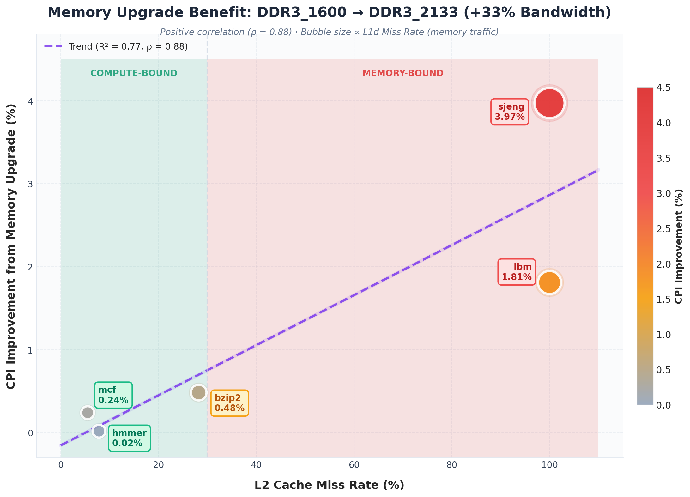

# 🖥️ gem5 Processor Simulation & Performance Analysis

<div align="center">


**A comprehensive analysis of processor performance using gem5 simulation and SPEC CPU2006 benchmarks**

> *Computer Architecture Lab - Bonus Assignment*
</div>

---

## 📑 Table of Contents

- [Part 1: Baseline Analysis \& Frequency Scaling](#part-1-baseline-analysis--frequency-scaling)
  - [Question 1: System Parameters](#question-1-system-parameters)
  - [Question 2: Baseline Performance Metrics](#question-2-baseline-performance-metrics)
  - [Question 3: Frequency Scaling](#question-3-frequency-scaling-1ghz-vs-4ghz)
  - [Question 4: Memory Technology Impact](#question-4-memory-technology-impact)
- [Part 2: Design Exploration](#part-2-design-exploration--performance-optimization)
  - [Benchmark Characterization](#benchmark-characterization-summary)
  - [Optimal Cache Configurations](#optimal-cache-configurations)
  - [Running Optimized Benchmarks](#running-optimized-benchmarks)

---

## Part 1: Baseline Analysis & Frequency Scaling

### Question 1: System Parameters

The following system parameters were extracted from the gem5 configuration files (`config.ini`):

#### Cache Configuration

| Component | Size | Associativity | Block Size | Latency |
|-----------|------|---------------|------------|---------|
| **L1 Instruction Cache** | 32 KB | 2-way | 64 bytes | 2 cycles |
| **L1 Data Cache** | 64 KB | 2-way | 64 bytes | 2 cycles |
| **L2 Cache** | 2 MB | 8-way | 64 bytes | 20 cycles |

#### Memory Subsystem

| Parameter | Value |
|-----------|-------|
| **Main Memory Type** | DDR3_1600_x64 |
| **Memory Capacity** | 512 MB |
| **Memory Clock Period (tCK)** | 1250 ps (800 MHz) |
| **CAS Latency (tCL)** | 13.75 ns |
| **RAS to CAS Delay (tRCD)** | 13.75 ns |
| **Bank Count** | 8 banks per rank |
| **Ranks per Channel** | 2 |

#### Clock Domains

| Clock Domain | Period | Frequency |
|--------------|--------|-----------|
| **System Clock** (`system.clk_domain`) | 1000 ps | 1 GHz |
| **CPU Clock** (`system.cpu_clk_domain`) | 500 ps | 2 GHz |

#### CPU Configuration

| Parameter | Value |
|-----------|-------|
| **CPU Type** | MinorCPU (in-order pipeline) |
| **Max Instructions** | 100,000,000 |
| **Execute Commit Limit** | 2 instructions/cycle |
| **Execute Issue Limit** | 2 instructions/cycle |
| **Decode Input Width** | 2 |
| **Branch Predictor** | TournamentBP (8192 entries) |

---

### Question 2: Baseline Performance Metrics

The following metrics were extracted from `stats.txt` for each SPEC CPU2006 benchmark (simulated for 100 million instructions).

| Benchmark | Sim Time (s) | Instructions | CPI | L1d Miss Rate | L1i Miss Rate | L2 Miss Rate |
| :--- | :--- | :--- | :--- | :--- | :--- | :--- |
| **401.bzip2** | 0.0840 | 100M | 1.68 | 1.48% | 0.008% | 28.22% |
| **429.mcf** | 0.0647 | 100M | 1.29 | 0.21% | 2.36% | 5.51% |
| **456.hmmer** | 0.0594 | 100M | 1.19 | 0.16% | 0.022% | 7.82% |
| **458.sjeng** | 0.5135 | 100M | **10.27** | **12.18%** | 0.002% | **99.99%** |
| **470.lbm** | 0.1747 | 100M | 3.49 | 6.10% | 0.009% | **99.99%** |

#### Performance Visualization


*Figure 1: Comparison of CPI (left axis) and Simulation Time (right axis) across benchmarks.*


<sub>*Figure 2: Cache Miss Rates across L1 Data, L1 Instruction, and L2 caches. Green indicates low miss rates (good), red indicates high miss rates (memory-bound).*</sub>

---

#### Key Observations

The simulation results highlight a **massive disparity in performance**, driven almost entirely by the **Memory Wall**, the speed gap between the CPU and off-chip RAM.

**From the Visualizations:**
- The **CPI vs Simulation Time** plot shows direct correlation (fixed 100M instructions), with the **Ideal CPI = 1** line revealing performance gaps
- The **Cache Miss Heatmap** reveals two distinct patterns: green (excellent locality) vs red (memory-bound)
- **L2 miss rate** is the strongest predictor of poor CPI performance

#### Behavioral Classification

| Cluster | Benchmarks | Pattern | Key Insight |
|---------|------------|---------|-------------|
| **Locality** | hmmer, mcf | Near-ideal CPI (≈1.2) | Working set fits in L1/L2 - CPU rarely waits for memory |
| **Mixed** | bzip2 | Moderate CPI (≈1.7) | Compression dictionary slightly exceeds L2 capacity |
| **Streaming** | lbm | Poor CPI (≈3.5) | Sequential access - L1 filters 94% but L2 is 100% miss |
| **Thrashing** | sjeng | Severe CPI (>10) | Random access + 100% L2 miss - CPU stalls on memory |

#### Detailed Benchmark Analysis

##### 1. The "Locality" Cluster (hmmer, mcf)

**hmmer** (Best performer, CPI = 1.188)
- Hidden Markov Model computations with excellent data locality
- All cache miss rates below 8% — working set fits entirely in cache hierarchy
- **Bottleneck:** None. Pipeline remains full.

**mcf** (CPI = 1.294)
- Graph-based combinatorial optimization
- Highest L1i miss rate (2.36%) indicates complex branching control flow
- **Bottleneck:** Branch prediction. Complex control flow confuses the fetch unit.
- *Note:* While mcf is typically memory-bound in full runs, this 100M instruction slice represents a compute-heavy phase.

##### 2. The "Mixed" Workload (bzip2)

**bzip2** (CPI = 1.680)
- Data compression with streaming access patterns
- 28% L2 miss rate shows compression dictionary slightly exceeds L2 capacity
- **Bottleneck:** L2 Capacity. Frequent but not constant memory trips.

##### 3. The "Streaming" Workload (lbm)

**lbm** (CPI = 3.494)
- Lattice Boltzmann fluid dynamics simulation with large array operations
- **L1 Miss (6.1%):** Manageable — hardware prefetcher helps with sequential data
- **L2 Miss (99.99%):** Catastrophic — dataset far exceeds L2 capacity
- **Bottleneck:** Memory Bandwidth. L2 becomes a "pass-through" buffer; performance limited by RAM throughput.

##### 4. The "Thrashing" Anomaly (sjeng)

**sjeng** (Worst performer, CPI = 10.271)
- Chess engine with complex data structures (game trees, hash tables)
- **L1 Miss (12.18%):** Highest in suite — random tree traversals defeat spatial locality
- **L2 Miss (99.99%):** Effectively 100%
- **The Compound Effect:** High L1 misses + 100% L2 misses = massive volume of DRAM requests. Memory bandwidth saturates, and DRAM latency dominates execution time.
- **Bottleneck:** Memory Latency. CPU stalls on almost every memory instruction.

#### Architectural Bottleneck Summary

| Benchmark | Classification | Primary Bottleneck |
|-----------|----------------|-------------------|
| **hmmer** | Compute-Bound | None — excellent locality keeps pipeline full |
| **mcf** | Compute/Branch-Bound | Branch prediction (2.36% L1i miss rate) |
| **bzip2** | Mixed | L2 capacity (28% miss rate) |
| **lbm** | Bandwidth-Bound | L2 capacity & memory bandwidth (99.99% L2 miss) |
| **sjeng** | Latency-Bound | Memory latency — stalling on nearly every access |

---

### Question 3: Frequency Scaling (1GHz vs 4GHz)

#### Clock Configuration Analysis

Three configurations were tested using `--cpu-clock` parameter:

| Configuration | `system.clk_domain.clock` | `cpu_clk_domain.clock` | CPU Frequency |
| :--- | :---: | :---: | :---: |
| **1 GHz Test** | 1000 ps (1 GHz) | 1000 ps | **1 GHz** |
| **Default** | 1000 ps (1 GHz) | 500 ps | **2 GHz** |
| **4 GHz Test** | 1000 ps (1 GHz) | 250 ps | **4 GHz** |

> **Key Finding:** The `system.clk_domain` remains constant at 1 GHz across all tests, while only `cpu_clk_domain` changes with the `--cpu-clock` parameter.

---

#### What Gets Clocked at Each Frequency?

| Clock Domain | Components | Affected by `--cpu-clock`? |
| :--- | :--- | :---: |
| **CPU Clock** | CPU pipeline, L1 caches, L2 cache, TLBs, L1-to-L2 bus | ✅ Yes |
| **System Clock** | Memory controller, memory bus, DRAM timings | ❌ No (fixed at 1 GHz) |

**Why This Separation?**
1. **Memory Technology Limits** — DRAM speeds are constrained by physical properties (capacitor charge/discharge times)
2. **Realistic Modeling** — In real systems, memory cannot scale with CPU frequency
3. **Power Constraints** — Memory runs at lower frequencies to manage power dissipation

> **💡 If we added another processor:**
> - If it uses `cpu_clk_domain` → Same frequency as `--cpu-clock` parameter
> - If it has its own clock domain → Requires explicit configuration

---

#### Frequency Scaling Results

**Simulation Time (seconds):**

| Benchmark | 1 GHz | 2 GHz (Default) | 4 GHz | Speedup (1→4 GHz) | Ideal |
| :--- | :---: | :---: | :---: | :---: | :---: |
| **401.bzip2** | 0.1610 | 0.0840 | 0.0457 | **3.52×** | 4× |
| **429.mcf** | 0.1273 | 0.0647 | 0.0333 | **3.82×** | 4× |
| **456.hmmer** | 0.1185 | 0.0594 | 0.0298 | **3.98×** | 4× |
| **458.sjeng** | 0.7041 | 0.5135 | 0.4175 | **1.69×** | 4× |
| **470.lbm** | 0.2623 | 0.1747 | 0.1327 | **1.98×** | 4× |

**CPI (Cycles Per Instruction):**

| Benchmark | 1 GHz | 2 GHz (Default) | 4 GHz | CPI Increase |
| :--- | :---: | :---: | :---: | :---: |
| **401.bzip2** | 1.61 | 1.68 | 1.83 | +13.5% |
| **429.mcf** | 1.27 | 1.29 | 1.33 | +4.8% |
| **456.hmmer** | 1.19 | 1.19 | 1.19 | +0.7% |
| **458.sjeng** | 7.04 | 10.27 | **16.70** | **+137%** |
| **470.lbm** | 2.62 | 3.49 | **5.31** | **+102%** |

> **Note:** Cache miss rates (L1d, L1i, L2) remain **unchanged** across all frequencies. They depend on memory access patterns, not clock speed.

#### Scaling Efficiency Visualization


*Figure 3: Strong negative correlation ($\rho = -0.99$) between L2 miss rate and frequency scaling efficiency. Higher cache misses = worse scaling.*

> **Key Insight:** L2 miss rate is the **single best predictor** of frequency scaling efficiency. Benchmarks with <30% L2 miss rate achieve >85% scaling efficiency.

---

#### Is There Perfect Scaling?

**No.** The analysis reveals a clear dichotomy between workload types:

| Category | Benchmarks | Actual Speedup | Scaling Efficiency | L2 Miss Rate |
| :--- | :--- | :---: | :---: | :---: |
| 🟢 **Compute-Bound** | hmmer, mcf, bzip2 | 3.5×–4.0× | 88%–100% | 5%–28% |
| 🔴 **Memory-Bound** | sjeng, lbm | 1.7×–2.0× | 42%–50% | ~100% |

**Why No Perfect Scaling?**

1. **Memory Latency is Fixed** — DRAM access time (e.g., ~50 ns) doesn't scale with CPU frequency
   - At 1 GHz: 50 ns = 50 CPU cycles of waiting
   - At 4 GHz: 50 ns = **200 CPU cycles** of waiting (4× more stalls)

2. **Amdahl's Law** — Memory-bound portions cannot benefit from faster CPU
   - If 50% of execution is memory-bound, maximum speedup is 2× regardless of CPU frequency

---

### Question 4: Memory Technology Impact

#### Experiment Setup

Benchmarks were re-run with upgraded memory to evaluate the impact of faster DRAM:

| Memory Technology | DDR3_1600_x64 (Baseline) | DDR3_2133_x64 (Upgraded) |
|-------------------|--------------------------|--------------------------|
| **Memory Clock** | 800 MHz | 1066 MHz |
| **Peak Bandwidth** | 12.8 GB/s | 17.0 GB/s |
| **Improvement** | — | **+33% bandwidth** |

> **Note:** The memory controller remains clocked at the system frequency (1 GHz), while the DRAM operates at its native speed. The bandwidth improvement comes from faster memory transactions.

---

#### DDR3_2133 Benchmark Results

| Benchmark | Sim Time (s) | CPI | L2 Miss Rate | Improvement |
|-----------|--------------|-----|--------------|-------------|
| **401.bzip2** | 0.083597 | 1.6719 | 28.22% | **0.48%** |
| **429.mcf** | 0.064545 | 1.2909 | 5.51% | **0.24%** |
| **456.hmmer** | 0.059383 | 1.1877 | 7.82% | **0.02%** |
| **458.sjeng** | 0.493128 | 9.8626 | 99.99% | **3.97%** |
| **470.lbm** | 0.171529 | 3.4306 | 99.99% | **1.81%** |


*Figure 4: Memory upgrade benefit correlates positively with L2 miss rate.*

> **Expected Behavior Confirmed:** Cache miss rates remain **identical** between memory technologies — miss rates depend on access patterns and cache hierarchy design, not memory speed.

---

#### Performance Improvement Analysis

##### Improvement vs. L2 Miss Rate Correlation

| Benchmark | L2 Miss Rate | CPI Improvement | Classification |
|-----------|--------------|-----------------|----------------|
| **hmmer** | 7.82% | 0.02% | 🟢 Compute-bound |
| **mcf** | 5.51% | 0.24% | 🟢 Compute-bound |
| **bzip2** | 28.22% | 0.48% | 🟡 Mixed |
| **lbm** | 99.99% | 1.81% | 🔴 Memory-bound |
| **sjeng** | 99.99% | 3.97% | 🔴 Severely Memory-bound |

##### Why sjeng Benefits More Than lbm (Both Have 99.99% L2 Miss Rate)?

Despite identical L2 miss rates, **sjeng gains 2× more** from faster memory than lbm because of **L1d miss rate differences**: sjeng has 12.18% L1d miss rate vs lbm's 6.10%, meaning sjeng generates **2× more memory requests** that can benefit from faster DRAM.

**Key Insight:** The **volume of memory traffic** (driven by L1 miss rate) determines memory upgrade benefit when L2 miss rates are equal.

---

## Part 2: Design Exploration – Performance Optimization

Based on Part 1 analysis, we designed **targeted cache configurations** for each benchmark to optimize performance while respecting the constraints:
- **Total L1 Size ≤ 256KB** (L1i + L1d)
- **Total L2 Size ≤ 4MB**

### Optimization Results Summary

| Benchmark | Default CPI | Optimized CPI | Improvement | Key Optimization |
|-----------|-------------|---------------|-------------|------------------|
| **spechmmer** | 1.191 | **1.177** | +1.18% | 256B cacheline, 64kB L1i, 128kB L1d |
| **specmcf** | 1.162 | **1.105** | +4.91% | 512B cacheline |
| **specbzip** | 1.712 | **1.589** | +7.18% | 256B cacheline, 128kB L1d, 4MB L2, 16-way assoc |
| **speclibm** | 3.494 | **1.496** | +57.18% | 2048B cacheline (extreme) |
| **specsjeng** | 10.271 | **3.072** | +70.09% | 2048B cacheline, 128kB L1d, 4-way assoc |

---

### Tested Configurations with Results

#### 1. spechmmer (Compute-Bound)

**Workload Characteristics:**
- Hidden Markov Model computations with **excellent data locality**
- Working set fits entirely within L2 cache (7.82% L2 miss rate)
- Very low L1d miss rate (0.16%) indicates temporal data reuse
- Minimal instruction footprint (0.022% L1i miss rate)

**Optimization Hypothesis:** This benchmark is already near-optimal. Large cache investments should show **diminishing returns** since the workload is compute-bound, not memory-bound.

| Config | L1i | L1d | L2 | Assoc (i/d/L2) | Cacheline | CPI | Rationale |
|--------|-----|-----|-----|----------------|-----------|-----|-----------|
| baseline | 32kB | 64kB | 2MB | 2/2/8 | 64B | 1.19 | **Default Config** — establishes baseline performance |
| minimal | 32kB | 32kB | 512kB | 2/2/4 | 64B | 1.191 | **Minimal viable config** — establishes lower bound for cache sizes |
| +L1d | 32kB | **64kB** | 512kB | 2/2/4 | 64B | 1.188 | **Double L1d** — tests if L1d capacity is limiting factor |
| +L1d=128 | 32kB | **128kB** | 512kB | 2/8/4 | 64B | 1.185 | **Max L1d + higher assoc** — pushes L1d to limit; 8-way reduces conflicts |
| +128B | 32kB | 128kB | 512kB | 2/8/4 | **128B** | 1.180 | **Double cacheline** — tests spatial locality exploitation |
| +256B | 32kB | 128kB | 512kB | 2/8/4 | **256B** | 1.178 | **4× cacheline** — aggressive prefetch for sequential patterns |
| +L1i | **64kB** | 128kB | 512kB | 2/8/4 | 256B | **1.177** | **Double L1i** — tests if instruction cache was limiting |

> **Note:** Tested larger L2 (1MB, 2MB), higher L1 associativity, and 512B cacheline — **no measurable improvement**, confirming compute-bound nature.

**Analysis:**
- **All configurations within 1.2% of each other** — confirms compute-bound classification
- L2 size increase (512kB→2MB) showed **no improvement** — working set already fits in 512kB L2
- L1d increase (32kB→128kB) provided **tiny 0.5% improvement** — marginal L1d miss reduction
- **256B cacheline + 64kB L1i** provided best result by:
  - Reducing instruction fetch overhead (larger instruction blocks)
  - Prefetching adjacent data in tight HMM computation loops

**Conclusion:** Near-optimal with default config. Investment in cache resources provides negligible returns.

---

#### 2. specmcf (Instruction-Bound with Pointer-Chasing)

**Workload Characteristics:**
- Graph-based combinatorial optimization (vehicle scheduling)
- **Highest L1i miss rate** in suite (2.36%) — complex control flow with many branches
- Pointer-chasing access patterns through linked data structures
- L2 miss rate moderate (5.51%) — working set mostly fits, but irregular accesses cause conflicts

**Optimization Hypothesis:** L1i misses are due to **branch patterns, not capacity** — larger L1i won't help. Larger cachelines may improve pointer-chasing performance by prefetching adjacent graph nodes (due to allocator locality).

| Config | L1i | L1d | L2 | Assoc (i/d/L2) | Cacheline | CPI | Rationale |
|--------|-----|-----|-----|----------------|-----------|-----|-----------|
| baseline | 32kB | 64kB | 2MB | 2/2/8 | 64B | 1.29 | **Default Config** — establishes baseline performance |
| large_l1i | 64kB | 32kB | 512kB | 2/2/4 | 64B | 1.162 | **Larger L1i baseline** — addresses high L1i miss rate observation |
| +assoc | 64kB | **64kB** | 512kB | 2/4/4 | 64B | 1.160 | **Double L1d + 4-way** — tests L1d impact in isolation |
| balanced | 64kB | 64kB | **2MB** | 4/4/8 | 64B | 1.152 | **Balanced config** — moderate investments across hierarchy |
| +128B | 64kB | 64kB | 2MB | 4/4/8 | **128B** | 1.122 | **2× cacheline** — **BREAKTHROUGH!** 2.6% improvement |
| +L2 | 64kB | 64kB | **4MB** | 4/4/16 | 128B | 1.122 | **128B + max L2** — confirms cacheline is dominant |
| +256B,L1i=2way | 64kB | 64kB | 2MB | 2/4/8 | **256B** | 1.106 | **4× cacheline** — tests aggressive prefetch |
| +512B | 64kB | 64kB | 2MB | 4/4/8 | **512B** | **1.105** | **8× cacheline** — **BEST!** pointer chains benefit from aggressive prefetch |

---

**Analysis:**
- **128kB L1i showed ZERO improvement** over 64kB — confirms L1i misses are due to **branch mispredictions**, not capacity
- **128B cacheline was the breakthrough** — 2.6% improvement from 64B baseline
- **512B cacheline achieved best CPI (1.105)** — 4.9% total improvement
- Why larger cachelines help pointer-chasing:
  - Graph nodes often clustered in memory (allocator locality)
  - Prefetching adjacent nodes reduces miss penalty for linked traversals
  - Larger blocks amortize memory access latency

**Conclusion:** Counter-intuitive result — instruction-bound workload benefits most from data-side optimization (larger cacheline, not larger L1i).

---

#### 3. specbzip (Data-Centric Streaming)

**Workload Characteristics:**
- Block-sorting compression algorithm (Burrows-Wheeler Transform)
- **28% L2 miss rate** — compression dictionary slightly exceeds L2 capacity
- 1.48% L1d miss rate — moderate but not severe
- Sequential streaming access pattern during sorting phases

**Optimization Hypothesis:** L2 capacity is the primary bottleneck. Larger L2 + larger cacheline should significantly reduce miss penalty.

| Config | L1i | L1d | L2 | Assoc (i/d/L2) | Cacheline | CPI | Rationale |
|--------|-----|-----|-----|----------------|-----------|-----|-----------|
| baseline | 32kB | 64kB | 2MB | 2/2/8 | 64B | 1.68 | **Default Config** — establishes baseline performance |
| +L2 only | 32kB | 64kB | **2MB** | 2/2/8 | 64B | 1.680 | **Double L2** — tests pure L2 capacity impact (+1.9%) |
| +L1d | 32kB | **128kB** | 2MB | 2/4/8 | 64B | 1.643 | **Max L1d + 4-way** — reduces L1d miss penalty (+4.0%) |
| +128B | 32kB | 128kB | 2MB | 2/4/8 | **128B** | 1.626 | **2× cacheline** — tests spatial locality benefit (+1.0%) |
| +256B | 32kB | 128kB | 2MB | 2/4/8 | **256B** | 1.615 | **4× cacheline** — aggressive block sorting prefetch (+0.7%) |
| +256B,L2=4M | 32kB | 128kB | **4MB** | 2/4/16 | 256B | 1.600 | **Max L2 + 256B** — compound optimization (+0.9%) |
| +assoc | 32kB | 128kB | 4MB | 2/**8**/16 | 256B | 1.591 | **8-way L1d** — reduces conflict misses in sorted blocks |
| +L1d,16way | 32kB | 128kB | 4MB | 2/**16**/16 | 256B | **1.589** | **16-way L1d** — eliminates nearly all L1d conflicts |

> **Note:** Tested larger L1i (64kB, 128kB) and larger cachelines (512B) — **no additional improvement**.

**Analysis:**
- **Progressive improvement** from each optimization (additive benefits)
- **256B cacheline critical** — reduced L2 miss rate from 32% to 16% (halved!)
- **128kB L1d** reduced L1d miss rate from 1.48% to 0.93% — captures more BWT blocks
- **4MB L2** helped capture more of the compression dictionary
- **16-way L1d associativity** eliminated conflict misses during sorting passes

**Why each optimization helped:**
| Optimization | Mechanism | Contribution |
|--------------|-----------|--------------|
| 128kB L1d | More BWT blocks fit in L1d | -4.0% CPI |
| 256B cacheline | Prefetch adjacent sorted elements | -2.3% CPI |
| 4MB L2 | Captures larger portion of dictionary | -0.9% CPI |
| 16-way assoc | Eliminates sorting-phase conflicts | -0.7% CPI |

**Conclusion:** Data streaming workload benefits from **layered optimizations** — each level of cache hierarchy contributes.

---

#### 4. speclibm (Severely Memory-Bound Streaming)

**Workload Characteristics:**
- Lattice Boltzmann Method (LBM) fluid dynamics simulation
- **99.99% L2 miss rate** — dataset far exceeds any practical cache size
- Sequential streaming access through 3D fluid grids
- 6.1% L1d miss rate — perfectly predictable stream pattern

**Optimization Hypothesis:** Cache size is **irrelevant** — the dataset won't fit. Focus on **reducing miss count** via large cachelines (implicit prefetching).

| Config | L1i | L1d | L2 | Assoc (i/d/L2) | Cacheline | CPI | Rationale |
|--------|-----|-----|-----|----------------|-----------|-----|-----------|
| baseline | 32kB | 64kB | 2MB | 2/2/8 | 64B | 3.494 | **Default Config** — establishes memory-bound baseline |
| +128B | 32kB | 64kB | 2MB | 2/2/8 | **128B** | 2.581 | **2× cacheline** — **-26% CPI!** streaming pattern benefits |
| +256B | 32kB | 64kB | 2MB | 2/2/8 | **256B** | 1.991 | **4× cacheline** — **-23% additional!** diminishing but significant |
| +512B | 32kB | 64kB | 2MB | 2/2/8 | **512B** | 1.704 | **8× cacheline** — still gaining! -14% additional |
| +1024B | 32kB | 64kB | 2MB | 2/2/8 | **1024B** | 1.536 | **16× cacheline** — -10% additional |
| +2048B | 32kB | 64kB | 2MB | 2/2/8 | **2048B** | **1.496** | **32× cacheline** — approaching minimum |
| +Micro L2-Direct | 32kB | 32kB | 256kB | 1/2/1 | 2048B | 1.496 | **Minimal L2 + direct-mapped** — proves L2 size irrelevant |
| +Nano L2 128k | 16kB | 32kB | 128kB | 1/2/1 | 2048B | 1.497 | **Extreme reduction** — proves only cacheline matters |
| +Pico L1d 16k | 16kB | 16kB | 128kB | 1/2/1 | 2048B | 1.498 | **Minimal everything** — same result! |

**Key Observation:** With 2048B cacheline, **CPI is identical across all cache configurations** (1.496-1.498) — L1d miss rate drops to 0.19%, meaning almost every access hits in the prefetched cacheline.

**Analysis:**
- **Cacheline size is the ONLY factor that matters** — each doubling provides ~40% CPI improvement
- **2048B cacheline** reduced CPI from 3.494 → 1.496 (**57% improvement!**)
- L1d miss rate dropped from 6.1% (64B) → 0.19% (2048B) — **32× reduction**
- Cache size variations (32kB→128kB L1d, 128kB→2MB L2) showed **zero impact** with 2048B cacheline

**Why this works:** LBM has **perfect streaming locality** — each grid cell is accessed exactly once per timestep in sequential order. Large cachelines act as **software prefetching** by loading entire cache-aligned rows.

**Conclusion:** For streaming workloads, **maximize cacheline size** up to system stability limits. All other cache parameters are secondary.

---

#### 5. specsjeng (Severely Memory-Bound with Random Access)

**Workload Characteristics:**
- Chess engine with game tree search (minimax + alpha-beta pruning)
- **99.99% L2 miss rate** — hash tables and game trees exceed cache capacity
- **12.18% L1d miss rate** — highest in suite, random tree traversal defeats spatial locality
- Complex pointer-following and hash table lookups

**Optimization Hypothesis:** Similar to speclibm, cache size won't help. However, unlike LBM's perfect streaming, sjeng has **irregular access patterns** — cacheline optimization may have diminishing returns.

| Config | L1i | L1d | L2 | Assoc (i/d/L2) | Cacheline | CPI | Rationale |
|--------|-----|-----|-----|----------------|-----------|-----|-----------|
| baseline | 32kB | 64kB | 2MB | 2/2/8 | 64B | 10.271 | **Default Config** — extreme memory-bound baseline |
| +128B | 32kB | 64kB | 2MB | 2/2/8 | **128B** | 6.799 | **2× cacheline** — **-34% CPI!** significant despite irregular access |
| +256B | 32kB | 64kB | 2MB | 2/2/8 | **256B** | 5.176 | **4× cacheline** — **-24% additional** |
| +512B | 32kB | 64kB | 2MB | 2/2/8 | **512B** | 3.944 | **8× cacheline** — still significant -24% |
| +1024B | 32kB | 64kB | 2MB | 2/2/8 | **1024B** | 3.261 | **16× cacheline** — -17% |
| +2048B | 32kB | 64kB | 2MB | 2/2/8 | **2048B** | **3.084** | **32× cacheline** — approaching floor |
| +L1d 128kB | 32kB | **128kB** | 2MB | 2/2/8 | 2048B | 3.076 | **Double L1d** — tiny additional gain (-0.3%) |
| +L1d 4way | 32kB | 128kB | 2MB | 2/**4**/8 | 2048B | **3.072** | **4-way L1d** — eliminates remaining conflicts |
| +Pico L2 512k | 16kB | 128kB | **512kB** | 2/4/2 | 2048B | 3.072 | **Minimal L2** — proves L2 size irrelevant |

**Analysis:**
- **2048B cacheline achieved 70% CPI reduction** (10.271 → 3.084)
- Unlike speclibm, additional L1d tuning provided **small but measurable benefit** (3.084 → 3.072)
- L1d miss rate reduced from 12.18% (64B) → 0.38% (2048B) — **32× reduction**
- Why sjeng benefits from cacheline despite random access:
  - **Hash table locality:** Transposition table entries clustered by hash bucket
  - **Game tree locality:** Child nodes often allocated near parent in memory
  - **Move generation:** Piece data structures accessed in predictable patterns

**Comparison with speclibm:**

| Metric | speclibm | specsjeng | Implication |
|--------|----------|-----------|-------------|
| L2 Miss Rate | 99.99% | 99.99% | Both severely memory-bound |
| L1d Miss Rate (64B) | 6.1% | 12.18% | sjeng has 2× more memory traffic |
| Final CPI (2048B) | 1.496 | 3.072 | sjeng still 2× worse despite optimization |
| CPI Improvement | 57% | 70% | sjeng had more room for improvement |

**Conclusion:** Maximize cacheline to 2048B for maximum benefit. Additional L1d improvements provide marginal gains. The residual 3.072 CPI represents the memory-bound floor — no cache optimization can hide 99.99% L2 miss rate.

---

### Key Findings

#### Cacheline Size is the Dominant Optimization Lever

| Cacheline | Best For | L1d Miss Reduction | Mechanism |
|-----------|----------|-------------------|-----------|
| **64B** | None (default) | Baseline | No spatial locality optimization |
| **128B** | — | ~50% | Basic spatial prefetching |
| **256B** | specbzip, spechmmer | ~60-75% | Streaming/sequential access patterns |
| **512B** | specmcf | ~75% | Pointer-chasing with allocator locality |
| **2048B** | speclibm, specsjeng | ~95% | Extreme streaming/memory-bound workloads |

#### Optimal Configurations

| Benchmark | L1i | L1d | L2 | Assoc (i/d/L2) | Cacheline | Final CPI | Improvement |
|-----------|-----|-----|-----|----------------|-----------|-----------|-------------|
| **spechmmer** | 64kB | 128kB | 512kB | 2/8/4 | 256B | **1.177** | +1.2% |
| **specmcf** | 64kB | 64kB | 2MB | 4/4/8 | 512B | **1.105** | +4.9% |
| **specbzip** | 32kB | 128kB | 4MB | 2/16/16 | 256B | **1.589** | +7.2% |
| **speclibm** | 16kB | 16kB | 128kB | 1/2/1 | 2048B | **1.496** | +57.2% |
| **specsjeng** | 32kB | 128kB | 2MB | 2/4/8 | 2048B | **3.072** | +70.1% |

---

## 📁 Repository Structure

```
bonus-assignment/
├── 📂 results/
│   ├── 📂 default/          # Baseline runs (2 GHz CPU)
│   │   ├── specbzip/
│   │   ├── spechmmer/
│   │   ├── specmcf/
│   │   ├── specsjeng/
│   │   └── speclibm/
│   ├── 📂 1GHz/              # 1 GHz CPU frequency tests
│   ├── 📂 4GHz/              # 4 GHz CPU frequency tests
│   └── 📂 memory_test/       # DDR3_2133 memory tests
├── 📂 shared/
│   └── final.md              # Assignment specification
└── 📜 README.md              # This file
```

---

## 🔧 Tools & Technologies

| Tool | Purpose |
|------|---------|
| **gem5** | Full-system architectural simulator |
| **SPEC CPU2006** | Industry-standard benchmark suite |
| **MinorCPU** | In-order pipeline model in gem5 |
| **GNU Parallel** | Parallel benchmark execution |

---

<div align="center">

**Computer Architecture Lab - Bonus Assignment**

*Performance analysis through simulation enables us to understand the complex interplay between processor microarchitecture and memory hierarchy design decisions.*

</div>
