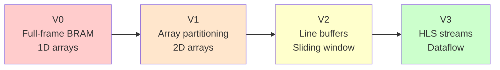

# HW Accelerated Kernel Versions Comparison

This document compares the evolution of the FPGA-accelerated image processing kernel across four optimization stages.

## Overview

| Version | Architecture | Parallelism | Data Flow | Key Feature |
|---------|-------------|-------------|-----------|-------------|
| **V0** | Sequential 3-stage | 64 px/chunk | Full-frame buffers | Baseline (safe) |
| **V1** | Sequential 3-stage | 64 px/chunk | 2D array buffers | Array partitioning |
| **V2** | Sequential 3-stage | 64 px/chunk | Line buffers + sliding window | Optimized filter stage |
| **V3** | **Dataflow pipeline** | 64 px/cycle | **HLS streams** | Full pipelining |

---

## Version Evolution

### V0 - Baseline Implementation
[accelerated_v0.cpp](file:///c:/computer-architecture/computer-architecture-labs/lab-2/VITIS_IDE/hw_src/accelerated_v0.cpp)

**Architecture**: Simple sequential 3-stage pipeline using **1D flat arrays**.

```cpp
static uint8_t C_tmp[IMAGE_SIZE];   // Full-frame buffer
static uint8_t C_filt[IMAGE_SIZE];  // Full-frame buffer
```

**Key Characteristics**:
- Uses `CHUNK_COUNT` macro (non-padded layout)
- 1D index calculation: `idx = i * WIDTH + j`
- Bound to BRAM with `bind_storage` pragma
- **No array partitioning** → filter stage cannot be pipelined efficiently

**Limitation**: Filter stage processes one pixel per cycle due to sequential memory access.

---

### V1 - Array Partitioning
[accelerated_v1.cpp](file:///c:/computer-architecture/computer-architecture-labs/lab-2/VITIS_IDE/hw_src/accelerated_v1.cpp)

**Architecture**: 2D array buffers with **cyclic partitioning**.

```cpp
static pixel_t C_tmp[HEIGHT][PADDED_WIDTH];
#pragma HLS ARRAY_PARTITION variable=C_tmp cyclic factor=3 dim=1
#pragma HLS ARRAY_PARTITION variable=C_tmp cyclic factor=PIXELS_PER_CHUNK dim=2
```

**Improvements over V0**:
| Aspect | V0 | V1 |
|--------|----|----|
| Buffer layout | 1D flat | 2D `[HEIGHT][PADDED_WIDTH]` |
| Index calculation | Linear | Row/column addressing |
| Partitioning | None | Cyclic (3 rows, 64 cols) |
| Filter pipelining | Sequential | **II=1 target** |

**Key Change**: Partitioning enables parallel access to 3 rows (for vertical neighbors) and 64 columns (for chunk-width processing).

---

### V2 - Line Buffer Architecture
[accelerated_v2.cpp](file:///c:/computer-architecture/computer-architecture-labs/lab-2/VITIS_IDE/hw_src/accelerated_v2.cpp)

**Architecture**: **Line buffers + sliding window** for the filter stage.

```cpp
uint512_t lb[2][CHUNKS_PER_ROW];   // 2 line buffers
#pragma HLS ARRAY_PARTITION variable=lb complete dim=1

uint512_t win[3][3];               // 3x3 sliding window
#pragma HLS ARRAY_PARTITION variable=win complete dim=0
```

**Improvements over V1**:
| Aspect | V1 | V2 |
|--------|----|----|
| Intermediate storage | Full-frame 2D arrays | 512-bit chunk arrays |
| Filter data structure | Random access | Sliding window |
| Memory efficiency | O(H × W) | O(2 × chunks/row) |
| Processing granularity | 1 pixel | **64 pixels** |

**Key Innovation**: Operates directly on 512-bit chunks, processing 64 pixels per clock cycle in the filter stage.

**Filter Loop Logic**:
```cpp
const int LOOP_LIMIT = TOTAL_CHUNKS + CHUNKS_PER_ROW + 1;  // Extra iterations to flush pipeline
```

---

### V3 - Dataflow Streaming
[accelerated_v3.cpp](file:///c:/computer-architecture/computer-architecture-labs/lab-2/VITIS_IDE/hw_src/accelerated_v3.cpp)

**Architecture**: **Full dataflow pipeline** with HLS streams.

```cpp
#include <hls_stream.h>

static hls::stream<uint512_t> stream_post("s_post");
static hls::stream<uint512_t> stream_filt("s_filt");

#pragma HLS STREAM variable=stream_post depth=16
#pragma HLS STREAM variable=stream_filt depth=16
#pragma HLS DATAFLOW
```

**Key Improvements over V2**:
| Aspect | V2 | V3 |
|--------|----|----|
| Stage execution | Sequential | **Overlapped (dataflow)** |
| Inter-stage communication | BRAM buffers | HLS streams |
| Total latency | 3× image passes | **Single pass** |
| Throughput | Limited by sequential stages | **64 px/cycle continuous** |

**Modular Design**:
```cpp
compute_diff_wide(A, B, stream_post);      // Stage 1: Difference + posterize
apply_filter_wide(stream_post, stream_filt); // Stage 2: Sharpen filter
write_result_wide(stream_filt, C);          // Stage 3: Memory write
```

**Performance**:
- **Throughput**: 64 pixels per clock cycle
- **Latency**: ~1,050 cycles (theoretical min: 1024 for 256×256)

---

## Optimization Summary



| Optimization | V0→V1 | V1→V2 | V2→V3 |
|--------------|-------|-------|-------|
| **Goal** | Enable parallel access | Reduce memory, chunk-level ops | Overlap stages |
| **Technique** | Array partitioning | Line buffers | Dataflow + streams |
| **Benefit** | II=1 in filter loop | 64 px/cycle in filter | All stages run in parallel |

---

## Common Elements Across All Versions

All versions share:
- **Interface**: 512-bit AXI master (`m_axi`) with separate bundles for A, B, C
- **Control**: AXI-Lite (`s_axilite`) for kernel control
- **Algorithm**: 3-stage processing (posterize → sharpen → output)
- **Sharpen kernel**: `[0 -1 0; -1 5 -1; 0 -1 0]`
- **Border policy**: Output border pixels set to 0
- **Helper functions**: `posterize()` and `clip_u8()` (inlined)
